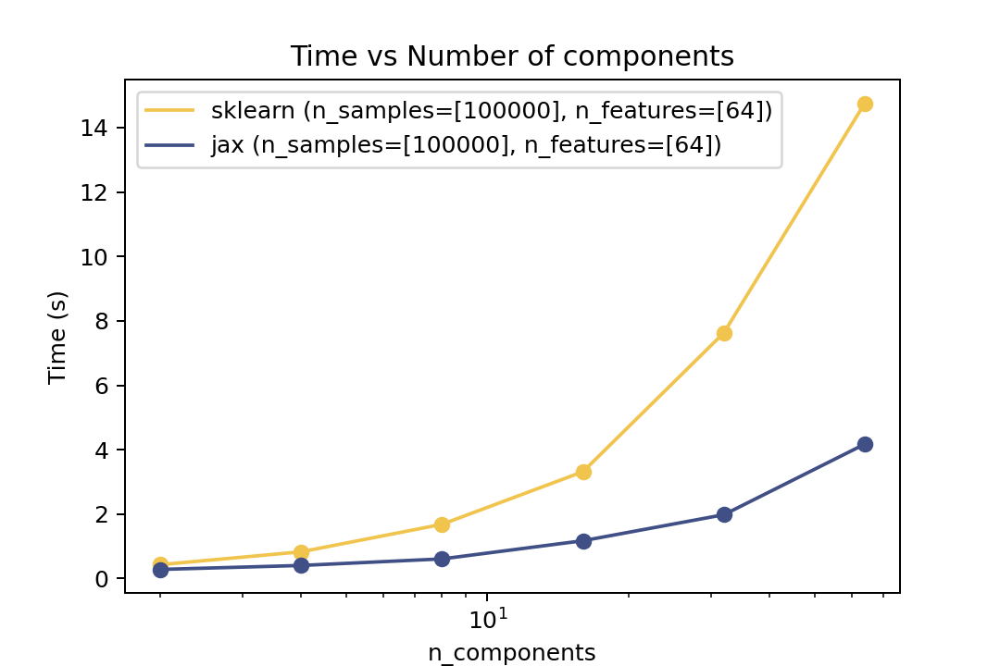
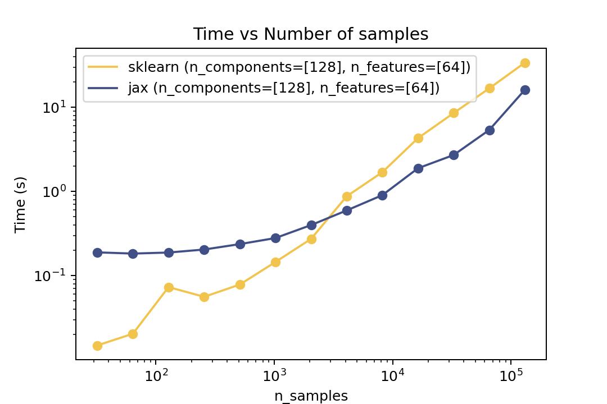
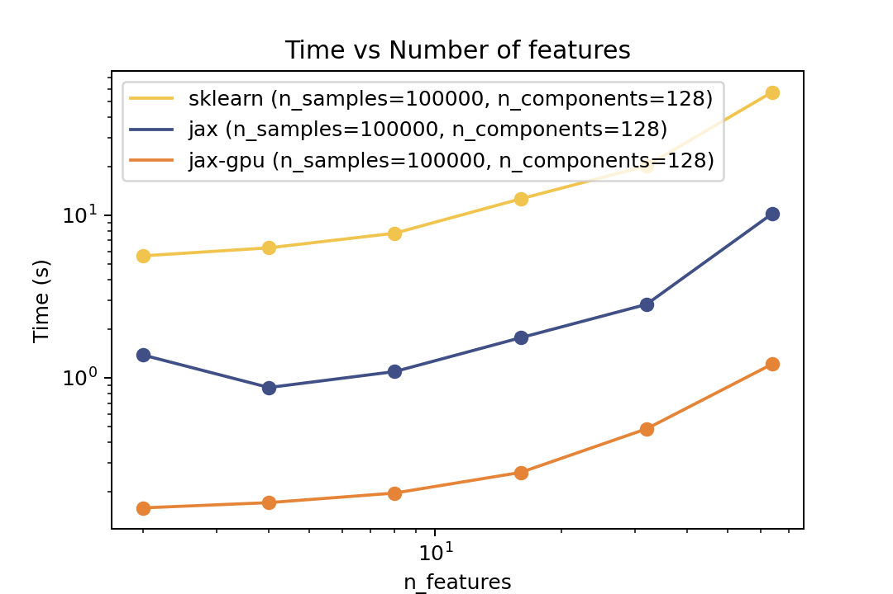
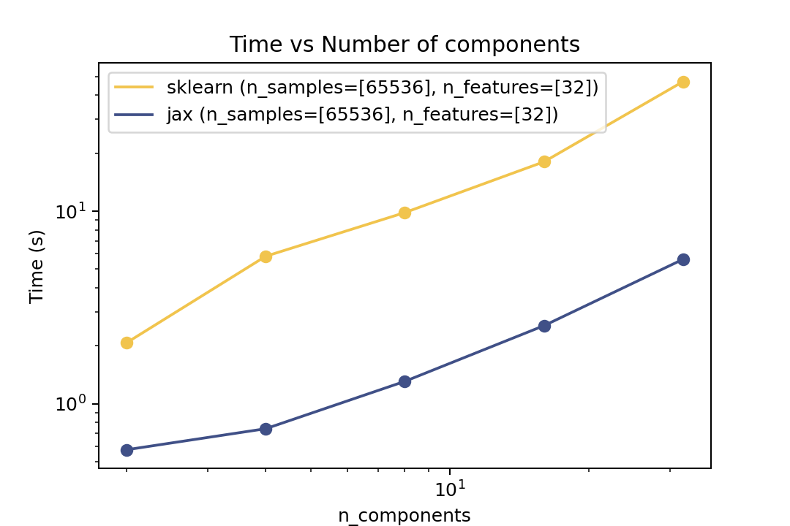
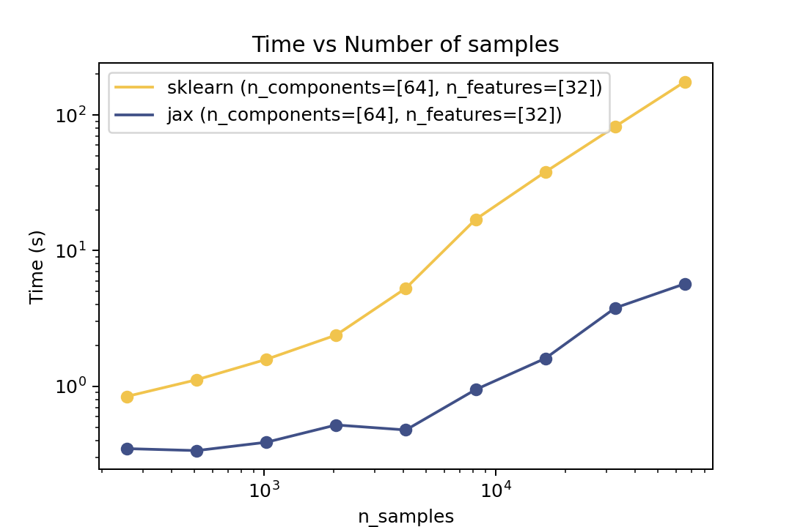
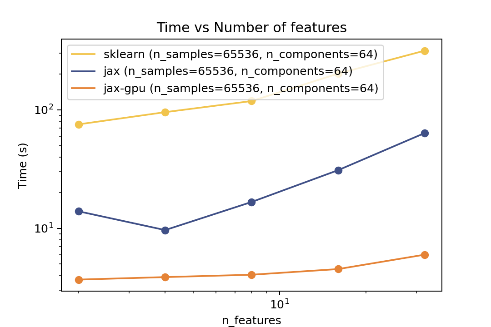

# GMMX: Gaussian Mixture Models in Jax

[](https://img.shields.io/github/v/release/adonath/gmmx)
[](https://github.com/adonath/gmmx/actions/workflows/main.yml?query=branch%3Amain)
[](https://codecov.io/gh/adonath/gmmx)
[](https://img.shields.io/github/commit-activity/m/adonath/gmmx)
[](https://img.shields.io/github/license/adonath/gmmx)

<p align="center">

</p>

A minimal implementation of Gaussian Mixture Models in Jax

- **Github repository**: <https://github.com/adonath/gmmx/>
- **Documentation** <https://adonath.github.io/gmmx/>

## Installation

```bash
pip install gmmx
```

## Usage

```python
from gmmx import GaussianMixtureModelJax, EMFitter

# Create a Gaussian Mixture Model with 16 components and 32 features
gmm = GaussianMixtureModelJax.create(n_components=16, n_features=32)

n_samples = 10_000
x = gmm.sample(n_samples)

# Fit the model to the data
em_fitter = EMFitter()
gmm_fitted = em_fitter.fit(gmm, x)
```

## Benchmarks

Here are some results from the benchmarks in the `benchmarks` folder comparing against Scikit-Learn. The benchmarks were run on a 2021 MacBook Pro with an M1 Pro chip.

### Prediction Time

| Time vs. Number of Components                                                   | Time vs. Number of Samples                                                | Time vs. Number of Features                                                 |
| ------------------------------------------------------------------------------- | ------------------------------------------------------------------------- | --------------------------------------------------------------------------- |
|  |  |  |

### Training Time

| Time vs. Number of Components                                               | Time vs. Number of Samples                                            | Time vs. Number of Features                                             |
| --------------------------------------------------------------------------- | --------------------------------------------------------------------- | ----------------------------------------------------------------------- |
|  |  |  |
